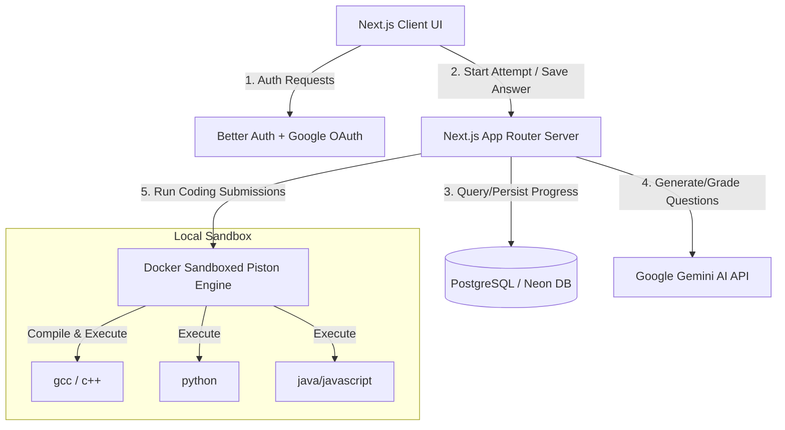
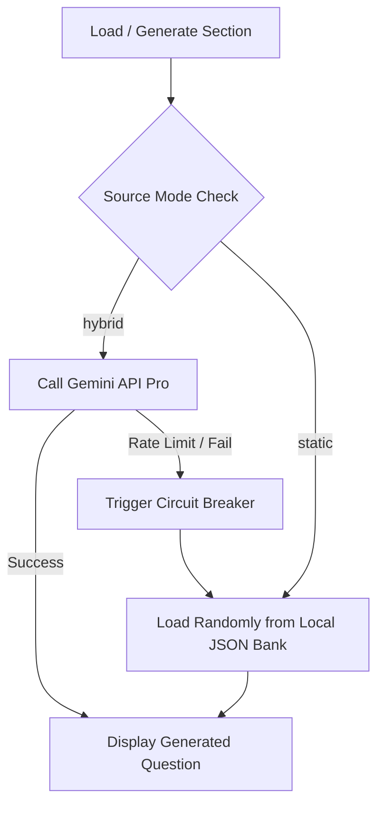

# MockOAI — Mock Online Assessment Platform


MockOAI is a full-featured mock test preparation platform designed specifically to simulate the actual format of corporate Online Assessments (OAs), such as the TCS NQT-Style exam. Unlike generic DSA grinding sites, MockOAI provides a unified, timed test interface that bundles English, Reasoning, Quant, CS Fundamentals, and live sandboxed Coding execution in one unified sitting. The platform integrates Gemini AI to generate custom, context-rich questions and provide deep post-assessment performance reviews, with dynamic fallback mechanisms to ensure complete offline viability.

---

## 📊 System Architecture & Workflow

Here is how the main components of MockOAI interact to deliver sandboxed code execution, AI grading, and database-driven rankings:



---

## 🛠️ Feature List (What is Built)

MockOAI is fully built and includes the following features:

### 1. Unified timed test engine (TCS NQT-Style)
* Timed exam sections matching NQT specification (English, Reasoning, Quant, CS Fundamentals, and Coding).
* Section boundary controls with review flags and sequential locking.
* Section prefetching runs in the background to eliminate loading pauses between sections.

### 2. Live coding sandbox execution
* Real-time sandbox code compiler using Piston execution.
* Multi-language support (C++, Python, Java, JavaScript) with custom test case matching.
* Standard error output, time limit monitoring, and detailed failure outputs.

### 3. Dynamic Question Source Hybridization & Fallback
* Supports three source modes—`static` (local JSON), `ai` (live Gemini), and `hybrid` (AI with automatic fallback). Environment variables `MCQ_SOURCE_MODE`, `CODING_SOURCE_MODE`, and `QUESTION_SOURCE_MODE` control the mode per section.
* In hybrid mode the system first attempts Gemini‑generated questions; if the request fails or the RPD quota is exhausted, a circuit breaker automatically switches to the static bank.
* This switchable architecture lets graders run the full app without consuming Gemini quota, making it a game‑changing feature for demos and offline testing.

### 4. Post-Exam Results Dashboard
* Circular progress visualizers and bar charts displaying section performance.
* Complete review screens for coding submissions detailing input arguments, expected vs actual compiler output, and passed/failed markers.
* Deep AI-generated summaries presenting customized feedback on coding logic and topic-wise revision advice.

### 5. Neo-Brutalist Leaderboard
* Dynamic, timeframe-based ranking dashboard showing user performance across **This Week**, **This Month**, and **All Time**.
* Visual Top-3 Podium styling with dynamic highlighter colors and flat neo-brutalist accents (reordering the top three players as 2-1-3 for a real podium effect).
* Sticky "Your Rank" widget anchored at the bottom when you scroll past your own row, allowing users to see their global position at a glance.

### 6. User Search & Follow System
* Debounced, case-insensitive user search widget that queries the database by username.
* Simple follow/unfollow toggle buttons that establish follower-following relationships between users.
* A dedicated **Friends** tab in the leaderboard that dynamically scopes results to only show the scores of the users you choose to follow.

### 7. Interactive Landing Page Simulator
* A dynamic mock OA attempt animation sequence showing MCQ progression, typed code submissions, sandbox test executions, and result compilations with micro-animations.

---

## 💻 Tech Stack

* **Frontend & Server**: Next.js 15 (App Router, React 19)
* **Styling**: Tailwind CSS v4, Vanilla CSS variables, and Lucide React icons
* **Authentication**: Better Auth with Google OAuth
* **Database & ORM**: PostgreSQL (Neon Database) and Prisma ORM
* **Code Execution**: Dockerized Piston Execution Engine
* **Artificial Intelligence**: Google Gen AI SDK (Gemini Pro)

---

## 🔑 Prerequisites

1. **Node.js**: `v18.x` or `v20.x` (recommended)
2. **Docker Desktop**: Required to host the sandboxed code execution environment
3. **Database**: A Neon PostgreSQL account or local PostgreSQL server
4. **Google Cloud OAuth Credentials**: For setting up Google Sign-In
5. **Gemini API Key**: A valid key from Google AI Studio

---

## ⚙️ Setup & Installation

Follow these exact steps in order to stand up MockOAI locally:

### Step 1: Clone and Install Dependencies
```bash
# Clone the repository
git clone https://github.com/Yash-Bankar/MockOAI
cd MockOAI

# Install npm dependencies
npm install
```

### Step 2: Configure Environment Variables
Copy `.env.sample` to `.env` and fill in the required credentials:
```bash
cp .env.sample .env
```
Ensure you provide:
* `DATABASE_URL` (PostgreSQL connection string)
* `BETTER_AUTH_SECRET` (generate with `openssl rand -hex 32`)
* `GOOGLE_CLIENT_ID` & `GOOGLE_CLIENT_SECRET` (from Google Cloud Console)
* `GEMINI_API_KEY` (from Google AI Studio)

### Step 3: Run Piston Code Execution Sandbox
Because the app compiles and executes user code locally, you must spin up Piston via Docker:
```bash
# Navigate to the piston configuration directory
cd piston

# Start the Piston docker container in detached mode(start docker app before this command if you are windows user)
docker-compose up -d
```

Next, configure the execution runtimes. Depending on your Operating System, run one of the following:

**On Linux/macOS/Git Bash:**
```bash
curl http://localhost:2000/api/v2/runtimes
```
You should see a JSON array (initially empty if no runtimes are installed yet).

Install the required language runtimes:

```bash
bash install-runtimes.sh
```

**On Windows (PowerShell):**
```powershell
# Run the PowerShell equivalent commands to register runtimes
Invoke-RestMethod -Uri "http://localhost:2000/api/v2/packages" -Method Post -ContentType "application/json" -Body '{"language":"gcc","version":"10.2.0"}'
Invoke-RestMethod -Uri "http://localhost:2000/api/v2/packages" -Method Post -ContentType "application/json" -Body '{"language":"python","version":"3.12.0"}'
Invoke-RestMethod -Uri "http://localhost:2000/api/v2/packages" -Method Post -ContentType "application/json" -Body '{"language":"java","version":"15.0.2"}'
```

**Verify Piston is running:**
Return to the root directory and test that the runtimes API returns the registered languages:
```bash
cd ..
curl http://localhost:2000/api/v2/runtimes
```

### Step 4: Setup Database & Seed Questions
Initialize Prisma schema migrations and run the local seeder to populate the exam configuration:
```bash
# Run Prisma migrations
npx prisma migrate dev --name init

# Seed database structure & static question bank
npm run seed
```

### Step 5: Start Development Server
```bash
npm run dev
```
Open **[http://localhost:3000](http://localhost:3000)** in your browser.

---

## 🔒 Google Cloud OAuth Setup

To configure authentication:
1. Visit the [Google Cloud Console Credentials Page](https://console.cloud.google.com/).
2. Create a new project or select an existing one.
3. Click **Create Credentials** -> **OAuth client ID** (select *Web application*).
4. Under **Authorized JavaScript origins**, add:
   * `http://localhost:3000`
5. Under **Authorized redirect URIs**, add the exact OAuth callback endpoint:
   * `http://localhost:3000/api/auth/callback/google`
6. Copy the generated Client ID and Client Secret into your `.env` file as `GOOGLE_CLIENT_ID` and `GOOGLE_CLIENT_SECRET`.

---

## ⚡ Question & AI Grading Source Modes



MockOAI supports toggling question generation/evaluation between `hybrid` and `static` modes using three environment variables in `.env`:
* `MCQ_SOURCE_MODE=hybrid` or `static`
* `CODING_SOURCE_MODE=hybrid` or `static`

### Why do these exist?
Google AI Studio's free-tier Gemini API has daily API call limits and rate limits (e.g., Requests Per Day cap). During continuous debugging, grading, or demo environments, this limit can be exhausted quickly. 

By setting `MCQ_SOURCE_MODE=static` and `CODING_SOURCE_MODE=static`, the platform will fetch questions entirely from the pre-seeded JSON file templates without invoking the Gemini API. This allows a grader or reviewer to test the full system instantly with **zero API calls and no active API key setup required**.

---

## 🔍 Verifying It Works

To confirm your local deployment is working correctly:
1. Go to `http://localhost:3000`, click **Start a Mock OA**, and sign in via Google OAuth.
2. Hit **Start New Mock OA** to load Section 1 (English). Verify that questions render on-screen.
3. Switch sections or fast-forward to the **Coding** section.
4. Select a language (e.g., Python), write a solution, and click **Run Code**. Verify that test cases compile and return logs (this confirms the Next.js server is successfully communicating with the dockerized Piston engine).
5. Click **Submit Exam** at the top right.
6. Verify that the **Results** dashboard loads successfully, showing a performance breakdown chart, detailed test case diagnostics, and an AI analysis card.

---

## ⚠️ Known Limitations

* **Local-only setup**: Piston and Google OAuth redirect hooks are configured for `http://localhost:3000`. Deploying to production requires exposing the Piston sandbox port securely and updating redirect credentials.
* **Docker requirement**: The coding section **requires** Docker to be running locally. If Docker or Piston is closed, running user code will fail with socket connection errors.
* **Gemini rate limits**: Free-tier Gemini keys have strict rate limits (RPD caps). While the hybrid circuit breaker shields the app from crash loops, heavy multi-user utilization can temporarily exhaust the keys.
* **Static mode limits**: If run entirely in static mode, questions will eventually repeat because the database utilizes a finite set of questions (60 MCQs per section, and 6 complex coding questions). But can switch to AI mode to avoid this.

---

## 📁 Project Structure Overview

Key directories of MockOAI:
```text
mockoai/
├── app/                      # Next.js App Router folders
│   ├── api/                  # Backend endpoints (Auth, Exam actions, Leaderboard, Run/Submit Code)
│   ├── components/           # Main client components (e.g. HeroSimulator)
│   ├── dashboard/            # User landing dashboard
│   ├── exam/                 # Main timed exam interface & sandbox IDE
│   └── leaderboard/          # Brutalist Leaderboard tabs & Followers widget
├── components/               # Shareable UI components (Card, Button, Badge)
├── data/                     # Local JSON mock test repositories
│   └── question-banks/       # English, Reasoning, Quant, CS, and Coding static questions
├── lib/                      # Shared helper files
│   ├── code/                 # Piston execution API wrapper & diff checkers
│   ├── question-source/      # Hybrid source router & JSON static parser
│   ├── auth.ts               # Better Auth initialization
│   └── prisma.ts             # Prisma client connection handler
├── piston/                   # Docker compose files and runtimes configuration script
└── prisma/                   # Database schema definitions and seed data script
```
